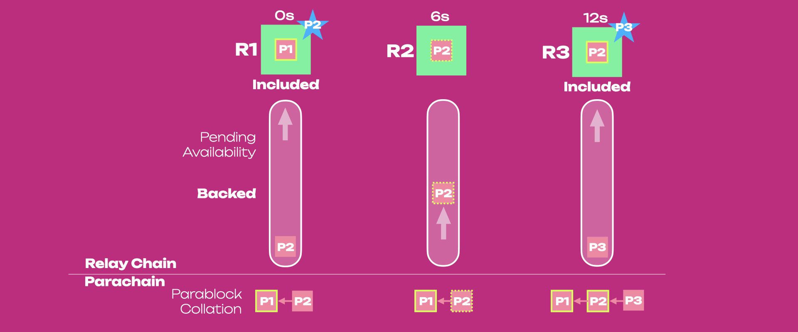
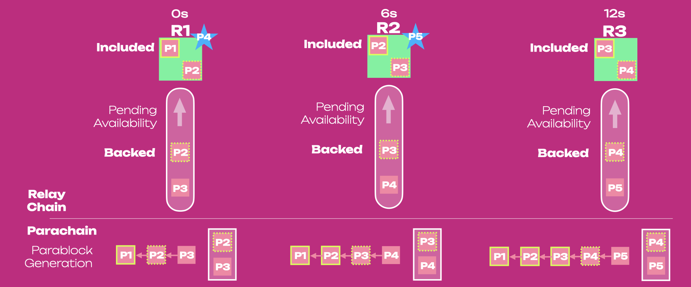

import RPC from "./../../components/RPC-Connection";

:::info Learn about Parachain Consensus

To fully follow the material on this page, it is recommended to be familiar with the primary stages
of the [Parachain Protocol](./learn-parachains-protocol.md).

:::

## Synchronous Backing

Before diving into asynchronous backing, it is important to understand what synchronous backing is
and what its main limitations are.

:::info What is backing?

**Backing** refers to the process in which a parablock is verified by a subset of validators who
determine the block’s validity. It is an important step in the validation process for parablocks, as
it is the first line of defense in ensuring valid state transitions. Validators who back the
parablock put their stake at risk, and if the block is later found invalid, those validators are
slashed.

:::

In synchronous backing, parablock generation is tightly coupled to the relay chain's progression on
a one-to-one basis. Every parablock must be generated and backed within a relay-chain block
(six-second window), and (if successfully backed) it will be included in a relay-chain block (often
referred to as the **relay parent** as the parablock anchors itself to it) after an additional six
seconds. Thus, a parablock can be produced every 12 seconds because a new parablock can be produced
after including the previous one. Note [candidate receipts](#candidate-receipt) and not the
parablocks themselves are included in relay parents.

### Sync Backing Mechanics

The diagram below shows the pipelining table for synchronous backing.

Backing (B) and inclusion (I) of each parablock happen on different relay chain blocks, and new
parablocks are generated once the previous parablock has been included.
[Contextual execution](#contextual-execution) is driven by the latest included parablock in the most
recent relay parent. After 24 seconds, two parablocks, P1 and P2, have been included in the relay
chain, and P3 has been backed.

In synchronous backing we can imagine parablocks on a conveyor belt. The belt is synched with the
relay chain: It takes six seconds (one relay block) to generate and back a parablock. It then takes
another six seconds to make that parablock available and mark it as included in a relay block. The
full process, from one end of the belt to the other, takes twelve seconds, and cannot be started for
parablock N + 1 until it is fully complete for parablock N (no [pipelining](#pipelining)).

The diagram below shows parablocks on the conveyor belt, on their way from being generated to being
backed and included into the relay parent.

Parablock 1 (P1) is included in the latest relay chain parent 1 (R1) after 6 seconds. Once P1 is
included, Parablock 2 (P2) can be generated using the included P1 in R1 as execution context. The
next parablock P3 can be generated after P2 is backed into R2 and included into R3, i.e. after 12
seconds.

The diagram below combines the previous diagrams and adds some context about blockspace.

Because P2 is rushing to be backed into R2 in 6 seconds, there are less than 6 seconds (~ 0.5
seconds) to fill it, since the other 5.5 seconds are needed to get the block backed on chain. In
this scenario, P2 is filled up to 70%. After the inclusion of P2 into R3, Parablock 3 (P3) will be
generated, filled to 50%, and backed into R4 in 6 seconds. This shows that, if blockspace demand
decreases, collators will always have 0.5 seconds to fill up blocks, leading to blocks that contain
less and less data.

The parablock generation and backing are bound together within a six-second window that limits the
amount of data a collator can add to each parablock. Essentially, a parablock is limited to the
requirement of being backed in six seconds, leaving little time for its generation and its
blockspace to be properly filled.

## Asynchronous Backing

:::warning Disclaimer: Performance Measurements

Due to asynchronous backing not being fully implemented in a running production network, each
performance metric is not thoroughly tested nor guaranteed until proper benchmarking has occurred.

:::

### Sync vs. Async Backing

Asynchronous Backing has three overarching goals:

1. Decrease parachain block (parablock) validation time to **6 seconds** from **12 seconds**
2. **Increase usable blockspace**, allowing more state changes per relay chain block.
3. **Allow parablocks to be re-proposed** to the network if they are not included successfully on
   the first attempt.

In synchronous backing, parablock generation relies on the most recent relay-chain block. Each
parablock must be generated and go through the entire backing process in a single relay block. It
then proceeds be made available and marked as included in the next relay block.

Asynchronous backing brings the following changes to the parachain protocol:

- Parablock generation is now decoupled from the backing process, avoiding the previous 6-second
  deadline through the backing process. This enables for more involved scaling approaches, such as
  giving more time for collators to properly use blockspace or increasing block velocity based on
  demand.

- Parachains can generate blocks and have them placed into **unincluded segments** of parablock
  ancestors rather than the latest, included relay chain parent.

### Async Backing Mechanics

Compared to [synchronous backing](#synchronous-backing-mechanics), in asynchronous backing:

- Filled blocks are placed in the unincluded segment, a record of not yet included parablocks stored
  locally on the parachain side.
- Every parablock candidate recorded in the unincluded segment is immediately advertised to
  validators to begin the backing process. And the unincluded segment keeps record of all candidates
  in the backing process right up until they are included. An unincluded segment may include
  candidates that are seconded, backable, or backed.
- A relay parent (not necessarily the latest relay block) and the parablock ancestors in the
  unincluded segment are used as execution context to generate a new parablock. Because the
  unincluded segment can carry multiple parablocks, parachains can take more time to fill new
  blocks.
- The conveyor belt can carry multiple parablocks ([pipelining](#pipelining)), and a parablock can
  be in a different stage from another one being built if it abides by the parameters set forth by
  the asynchronous backing configuration.
- Backing and inclusion events can happen within the same relay chain block (i.e. in 6 seconds)

The diagram below shows the pipelining table for asynchronous backing.

Backing (B) of block N + 1 and inclusion (I) of block N happen on the same relay chain block, and
new parablocks are generated before the previous parablock has been included.
[Contextual execution](#contextual-execution) is obtained by a relay parent (not necessarily the
latest block) and the latest included parablock ancestor in the
[unincluded segment](#unincluded-segments). In 24 seconds, four parablocks, P1 to P4, have been
included in the relay chain, and P5 has been backed.

The diagram below shows parablocks on their way from being generated to being backed and included
into the relay chain in the context of asynchronous backing.

Parablock 1 (P1) is included, and P2 is backed within R1. In the meantime, the unincluded segment is
full and contains P2-4. After P4 is added to the segment and pushed to the relay chain to begin the
backing process, P5 can be generated. After 6 seconds, P2 is included (and deleted from the
segment), P3 is backed in R2, and P5 has been added to the segment and pushed to the relay chain to
be backed. The segment now contains P3-5. Once a parablock has been included, there is no need to
keep it in the segment.

The diagram below combines the previous diagrams and adds some context about blockspace.

In synchronous backing collators generated parablocks in 0.5 seconds, since the other 5.5 seconds
were needed to get the block backed on chain. In asynchronous backing, because P5 is not rushing to
be backed (P3-4 are in the backing process), it can be filled in 2s while P2 is included and P3 is
backed in R2. This is possible because the context execution shifted from being the latest included
parablock in the latest relay parent, to being the latest ancestor in the unincluded segment (i.e.
P4).

In this scenario, blockspace demand decreases from P3 to P5. In theory, the next block P6 can be
filled in >2s seconds while P4 is included and P5 is backed. Collators could make better use of
blockspace, including more data by increasing block generation time in a period of lower demand.
Note that even if a collator has >2 seconds to produce a block, the validator will still have less
than 6 seconds (~2 seconds) to check it. So, if collators take >2 seconds to generate blocks the
unincluded segment will shrink (and there will be less parablocks in the pipeline), while if they
take <2 seconds the segment will elongate until it reaches the `maximum capacity` (and there will be
less parablocks in the pipeline).

For example, in case increased blockspace demand after the generation of P6, collators could
generate P7 and P8 within a 6-second window due to the unincluded segment being 2/3 filled (see
below). However, if demand stays high after P8, collators will only be able to generate parablocks
every 6 seconds as validators can back parablocks every 6 seconds.

In general, asynchronous backing will allow [collators](./learn-parachains-protocol.md#collators) to
include an estimated ~3-5x more data into parablocks while speeding up parachain block times from 12
to 6 seconds. Due to the 2x decrease in block time to inclusion and the possibility of building
blocks in advance to fit more data, Polkadot with asynchronous backing can deliver an estimated
~6-10x more blockspace to its parachains.

This combination of lower latency, higher storage per block, and a logical pipeline spanning
Polkadot's networking, runtime, and collation aspects will allow for higher, more robust throughput.

### Sync Backing as corner case of Async Backing

Two parameters of asynchronous backing can be controlled by
[Governance](./learn-polkadot-opengov.md):

- [`allowed_ancestry_len`](https://github.com/paritytech/polkadot-sdk/blob/f204e3264f945c33b4cea18a49f7232c180b07c5/polkadot/primitives/src/vstaging/mod.rs#L54):
  the number of parachain blocks a collator can produce that are not yet included in the relay
  chain.
- [`max_candidate_depth`](https://github.com/paritytech/polkadot-sdk/blob/f204e3264f945c33b4cea18a49f7232c180b07c5/polkadot/primitives/src/vstaging/mod.rs#L49):
  the oldest relay chain parent a parachain block can be built on top of.

Values of zero for both correspond to synchronous backing: `allowed_ancestry_len = 0` means there
can be only 1 parablock at a time on the conveyor belt, `max_candidate_depth = 0` means a parachain
block can be built only on the latest relay parent for that parachain. Those two parameters will be
initially set to 3 and 2, respectively.

## Terminology

### Candidate Receipt

Saying that a parablock has been included in a realy chain parent does not mean that the entire
parablock is in the relay chain block. Instead, **candidate receipt** consisting of the hash of the
parablock, state roots and ID info is placed on the parent block on the relay chain. The relay chain
does not access the entire state of a parachain but only the values that changed during that block
and the merkelized hashes of the unchanged values.

### Pipelining

Asynchronous backing is a feature that introduces
[pipelining](https://www.techtarget.com/whatis/definition/pipelining) to the parachain block
[generation, backing and inclusion](./learn-parachains-protocol.md). It is analogous to the logical
pipelining of processor instruction in "traditional" architectures, where some instructions may be
executed before others are complete. Instructions may also be executed in parallel, enabling
multiple processor parts to work on potentially different instructions simultaneously.

Bundles of state transitions represented as blocks may be processed similarly. In the context of
{{ polkadot: Polkadot :polkadot }}{{ kusama: Kusama :kusama }}, pipelining aims to increase the
throughput of the entire network by completing the backing and inclusion steps for different blocks
at the same time. Asynchronous backing does not just allow for pipelining within a single pipe (or
core). It lays the foundation for a large number of pipes (~10 cores) to run for the same parachain
at the same time. In that way we have two distinct new forms of parallel computation: having one
block backed and one included simultaneously using one core, and having having `n` blocks backed and
`n` blocks included simultaneously using `n` cores.

### Contextual Execution

Contextual execution refers to the context built by parablock ancestors used by collators to
generate new parablocks. The difference in execution context between synchronous and asynchronous
backing is as follows:

In synchronous backing, the entire execution context comes from the latest relay block and most
recently included parablock from the same parachain.

In asynchronous backing, a baseline execution context is first set up using a parablock's relay
parent and the most recently included parablock as of that relay parent. The relay parent need not
be the most recent relay block. Predecessors of the block under construction live in the
[unincluded segment](#unincluded-segments) placed directly in the runtime of parachain collators

Synchronous backing uses execution context entirely pulled from the relay chain. While asynchronous
backing augments this with additional context from the unincluded segment.

### Unincluded Segments

Unincluded segments are chains of candidate parablocks that have yet to be included in the relay
chain, i.e. they can contain parablocks at any stage pre-inclusion. The backing process occurs on
the relay chain, whereas unincluded segments live in the runtimes of parachain collators. The core
functionality that asynchronous backing brings is the ability to build on these unincluded segments
of block ancestors rather than ancestors included in the relay chain state.

The purpose of each unincluded segment is two fold:

- Make each parachain aware of when and at what depth it can build blocks that won't be rejected by
  the relay chain
- Provide critical context necessary to build parablocks with parent blocks that have yet to be
  included. The unincluded segment is all about building parablocks.

### Prospective Parachains

The purpose of
[prospective parachains](https://paritytech.github.io/polkadot/book/node/backing/prospective-parachains.html)
is two fold:

- Keep track of parablocks which have been submitted to backers but not yet included. This includes
  tracking the full unincluded ancestry of each parablock, without which it wouldn't be possible to
  verify their legitimacy.

- Look up and provide candidates which are children of the most recently included parablock for each
  parachain. These are taken as inputs to the availability process. Prospective parachains is all
  about tracking, storing, and providing candidates to the availability/inclusion step.

Prospective parachains essentially repeats the work each [unincluded segment](#unincluded-segments)
does in tracking candidates. Validators cannot simply trust the availability or validity of records
kept on parachains. Prospective parachains is the relay chain's record of all parablock candidates
undergoing the backing and inclusion process. It is the authoritative gate keeper for parablock
validity. Whereas the unincluded segment is a local record which allows parachains to produce blocks
which comply with the rules prospective parachains later enforces.

The unincluded segment lives in the parachain runtime, so it doesn't know or care about forks/other
parachains. Prospective parachains lives in the relay chain client. So it has to simultaneously keep
track of candidates from all forks of all parachains. It is as if you folded the unincluded segments
from every fork of every parachain into one giant data structure. When you fold unincluded segments
representing different chain forks together, they create a tree structure. Hence the term
[**fragment tree**](https://paritytech.github.io/polkadot/book/node/backing/prospective-parachains.html#fragment-trees).

A single unincluded segment tells a collator whether it can build on top of one fork of one
parachain. Prospective parachains tells a validator whether it should accept blocks built on top of
any fork from any parachain.

A parablock stops being a prospective parablock at the moment when it is included on chain. At that
point prospective parachains doesn't have to care about it anymore. Alternatively, a parablock's
relay parent can get too old before that parablock is included, in which case prospective parachains
can throw away the candidate.

The Prospective Parachains subsystem communicates with other subsystems in the validation process,
such as the Backing subsystem, once a candidate block has been seconded.

## Learn More

This topic is evolving and being implemented at the moment, keep up to date using the following
resources:

- [Polkadot Roadmap Roundup](https://polkadot.network/blog/polkadot-roadmap-roundup) - Article by
  Rob Habermeier, Polkadot founder, details the plans for Polkadot for 2023.
- [Asynchronous Backing Spec & Tracking Issue](https://github.com/paritytech/polkadot/issues/3779) -
  The implementation tracking issue for asynchronous backing
- [Prospective Parachains Subsystem - The Polkadot Parachain Host Implementers' Guide](https://paritytech.github.io/polkadot/book/node/backing/prospective-parachains.html)
- Chapter 6.11. from Polkadot Blockchain Academy (PBA) lecture material:
  [Asynchronous Backing (Shallow)](https://polkadot-blockchain-academy.github.io/pba-book/polkadot/async-backing-shallow/page.html)
- Chapter 6.15. from PBA lecture material:
  [Asynchronous Backing (Deep)](https://polkadot-blockchain-academy.github.io/pba-book/polkadot/async-backing-deep/page.html)
- Polkadot Blog Post -
  [Asynchronous Backing: Elevating Polkadot's Performance and Scale](https://www.polkadot.network/blog/elevating-polkadots-performance-and-scale-with-asynchronous-backing)
